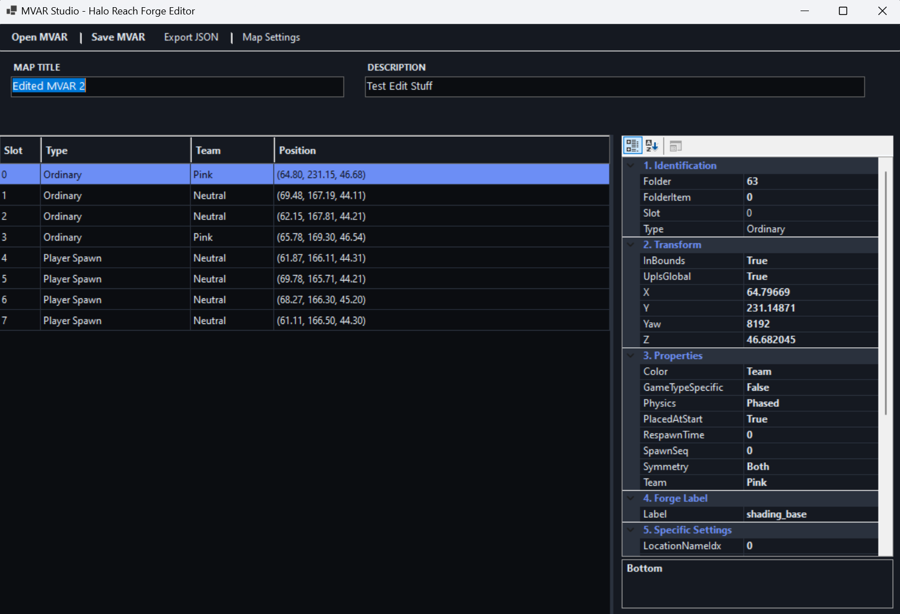

# MVAR Studio - Halo Reach Forge Map Editor

MVAR Studio is a lightweight C# desktop application designed for advanced editing of Halo Reach Forge Map Variant (`.mvar`) files. It provides a user-friendly interface to modify object transforms, team assignments, metadata, and more, which were previously limited by the in-game Forge menu.

## ✨ Key Features

- 🎨 **Modern Dark UI**: A sleek, high-contrast interface designed for long editing sessions.
- 🔽 **Smart Editing**:
  - **Dropdown Selection**: Quick selection for Teams, Colors, and Physics types.
  - **Dynamic Forge Labels**: Automatically parses and lists all forge labels available in the map variant.
- 📐 **Precise Transforms**: Edit object Position (X, Y, Z) and Yaw with higher precision than the game allows.
- 🛠️ **Map Settings**:
  - Edit Map Title, Description, and Author metadata.
  - Toggle global flags like **Hard Boundary** (Out of Bounds) and **Cinematic Camera**.
  - Adjust the **Map Bounding Box** (Use with caution!).
- 📦 **JSON Export**: Export your map data and object positions to a structured JSON format—perfect for importing into Blender or other 3D software.
- 💾 **Safe Encoding**: Robust MVAR encoding logic ensures your files remain compatible with MCC and Xbox.

## 🚀 Getting Started

### Prerequisites
- [.NET 8.0 Runtime](https://dotnet.microsoft.com/download/dotnet/8.0) (Windows)

### Running the App
1. Download the latest release from the [Releases](https://github.com/Sopitive/MapVariantEditor/releases) page.
2. Launch `MVARStudio.exe`.
3. Click **Open MVAR** and select your `.mvar` file (typically found in your MCC save directory).
4. Edit objects in the list and save your changes.

## 🛠️ Tech Stack
- **Language**: C# (.NET 8.0 Windows Forms)
- **Library**: Custom Bitstream parser/encoder for Halo BLF/MVAR formats.
- **Serialization**: System.Text.Json for map exports.

## ⚠️ Disclaimer
Manipulating map data directly can lead to unexpected behavior. Always keep a backup of your original `.mvar` files before saving.

## 🤝 Credits

- Developed as an open-source tool for the Halo reverse engineering and modding community.
- Special thanks to **DavidJCobb** for their extensive previous research and documentation on the `.mvar` format, which was instrumental in building this tool.
